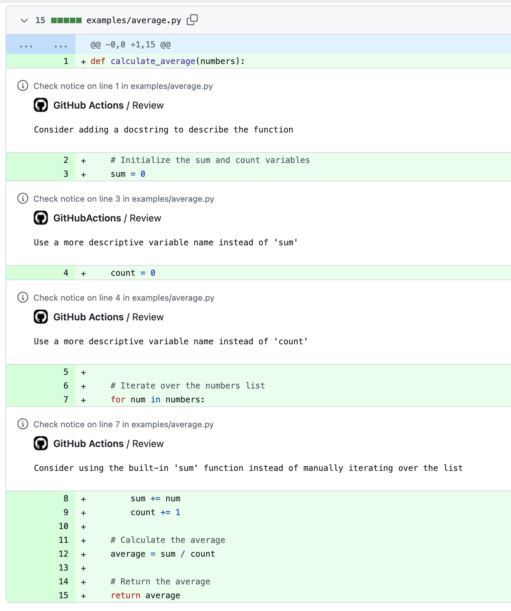

# LLM Action - Review PRs with LLMs
Use an LLM and user given instructions to annotate Pull Requests.

## Usage

It runs through the Azure OpenAI service, so you need to provide your credentials for that.

```yaml
- uses: timotk/github-llm-action@v1
  with:
    file_pattern: "examples/blog.txt"
  env:
    AZURE_OPENAI_API_KEY: ${{ secrets.AZURE_OPENAI_API_KEY }}  # Your Azure OpenAI API Key
    AZURE_OPENAI_ENDPOINT: "https://<your-endpoint-name>.openai.azure.com/"
    AZURE_OPENAI_DEPLOYMENT: "gpt-35-turbo-us"  # The deployment name for your model
    AZURE_OPENAI_API_VERSION: "2023-07-01-preview" # The model/api version
```

If you want to add additional instructions, use:
```yaml
- uses: timotk/github-llm-action@v1
  with:
    file_pattern: "examples/blog.txt"
    additional_user_prompt: "Make suggestions for conciseness, clarity and writing style."
```

It is not limited to just text. Here, we create an action to review some python code, with an additional user prompt:
```yaml
- uses: timotk/github-llm-action@v1
  with:
    file_pattern: "examples/blog.txt"
    additional_user_prompt: "Make sure the code is pythonic"
```
which will result in the following annotations:
