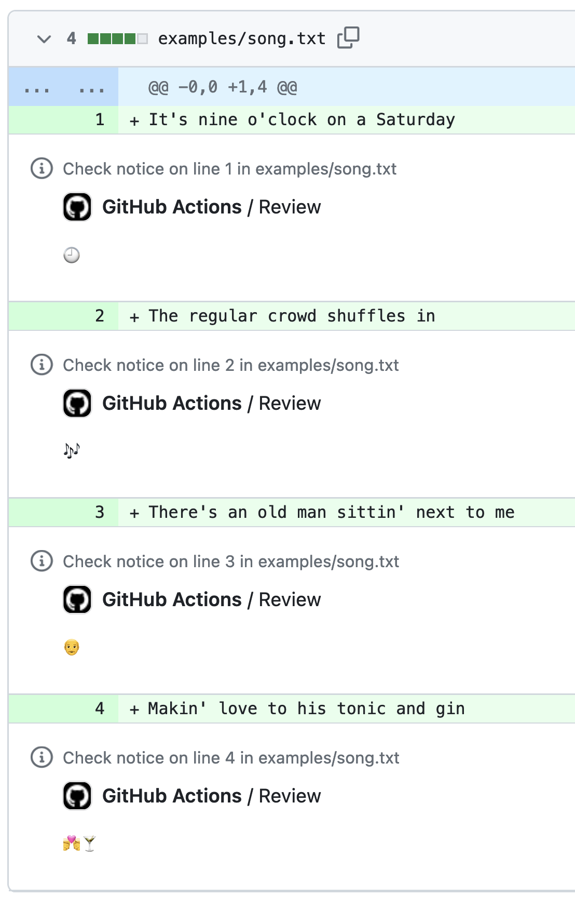

# LLM Review Action - Review PRs with LLMs
Use an LLM and user given instructions to annotate Pull Requests.

## Usage
It runs through the Azure OpenAI service, so you need to provide the following credentials:
- Azure OpenAI API Key
- Azure OpenAI Endpoint URL
- Azure OpenAI Deployment name
- Azure OpenAI API Version

### Default usage
Here's how you can use the action with the default settings.

```yaml
- uses: timotk/llm-review-action@v1
  with:
    file_pattern: "examples/blog.txt"
  env:
    AZURE_OPENAI_API_KEY: ${{ secrets.AZURE_OPENAI_API_KEY }}  # Your Azure OpenAI API Key
    AZURE_OPENAI_ENDPOINT: "https://<your-endpoint-name>.openai.azure.com/"
    AZURE_OPENAI_DEPLOYMENT: "gpt-35-turbo"  # The deployment name for your model
    AZURE_OPENAI_API_VERSION: "2023-07-01-preview" # The model/api version
```
By default, the LLM is simply instructed to review the file. Therefore, the LLM will infer the content.

### Usage with custom instructions
If you want to add custom instructions, provide them with the `additional_user_prompt` parameter:
```yaml
- uses: timotk/llm-review-action@v1
  with:
    file_pattern: "examples/blog.txt"
    additional_user_prompt: "Make suggestions for conciseness, clarity and writing style."
```

### Usage with templates
To use predefined prompt templates from the `templates` directory, you can specify `template_name`. For example, using the [`python`](templates/python.txt) template:
```yaml
- uses: timotk/llm-review-action@v1
  with:
    file_pattern: "examples/*.py"
    template_name: "python"
```

# Examples
## Reviewing code
It is not limited to just text. Here, we use the action with GPT-3.5-turbo to review some python code, with an additional user prompt:
```yaml
- uses: timotk/llm-review-action@v1
  with:
    file_pattern: "examples/average.py"
    additional_user_prompt: "Make sure the code is pythonic"
```
which will result in the following annotations:


## Adding emojis to song lyrics
We can provide any suggestion we like to the LLM. Here, we let the LLM suggest emojis for our song lyrics:
```yaml
- uses: timotk/llm-review-action@v1
  name: Emojify a song
  with:
    file_pattern: "examples/song.txt"
    additional_user_prompt: "Suggest an emoji for each line, nothing else"
```

This will result in:

